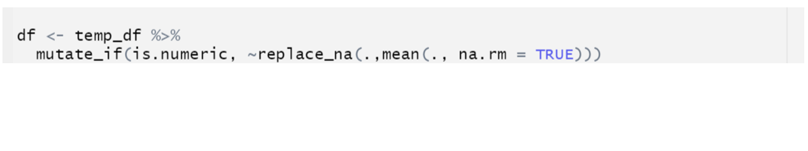
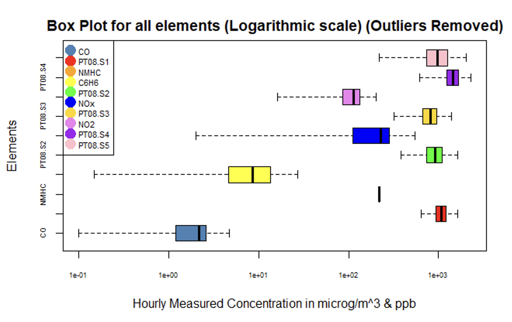
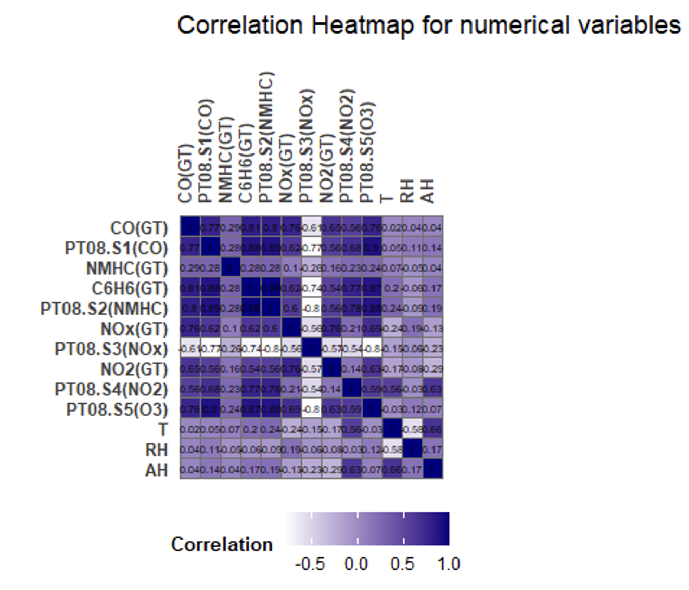
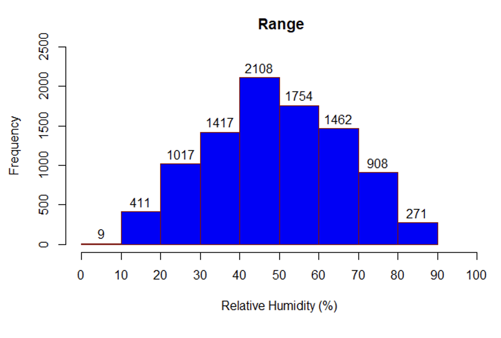
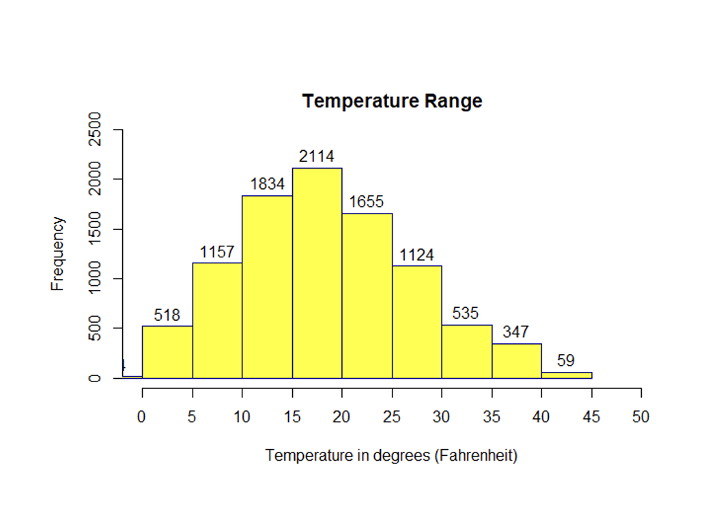
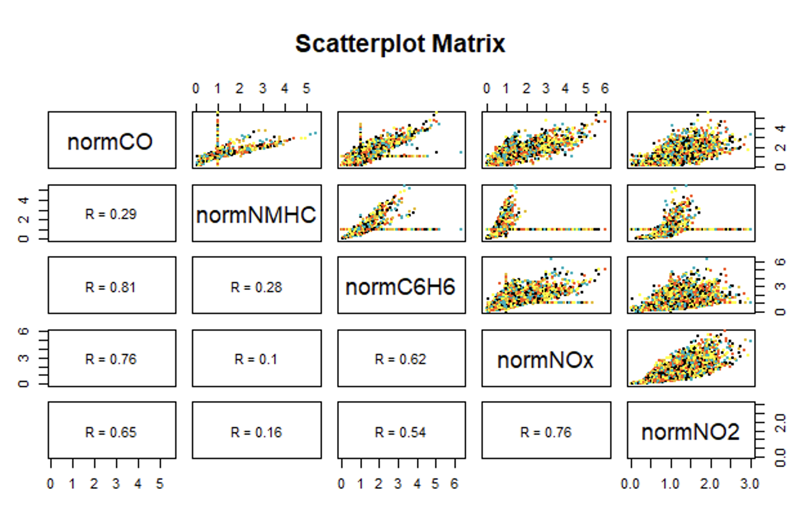
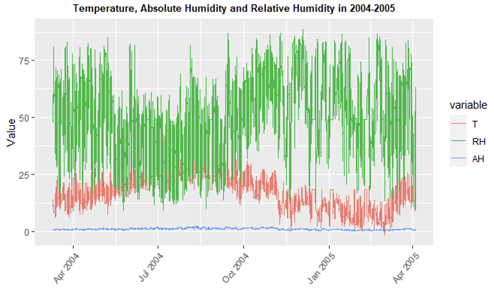
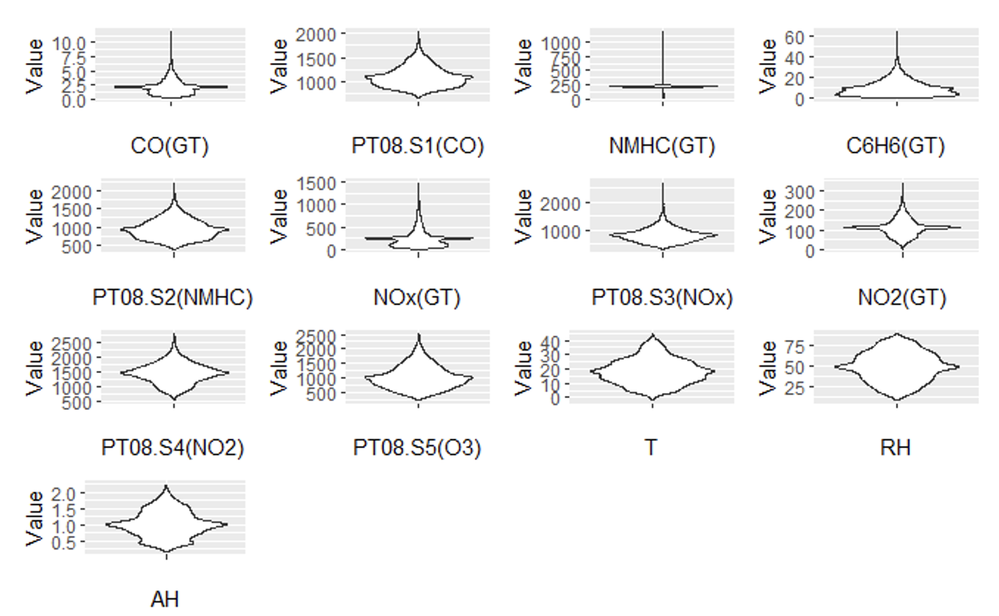

# Air Quality Index Analysis Using Tableau

## Overview
This project focuses on analyzing air quality data using Tableau for visualization. We utilized a dataset from the UCI Machine Learning Repository, featuring hourly averaged responses from a chemical sensor device deployed in a significantly polluted area within an Italian city. The dataset spans from March 2004 to February 2005, containing 9358 instances and 15 attributes, including ground truth for CO, Non-Methanic Hydrocarbons, Benzene, Total Nitrogen Oxides (NOx), and Nitrogen Dioxide (NO2).

## Dataset Description
- **Source**: [Satellite Database](https://archive.ics.uci.edu/ml/datasets/air+quality)
- **Dataset Characteristics**: Multivariate/Time-Series
- **Attribute Characteristics**: Real
- **Instances**: 9358
- **Attributes**: 15, including sensor responses and ground truth concentrations of various pollutants.

## Data Preprocessing
The dataset had instances with missing values marked as -200. These were replaced with the mean of the respective columns to maintain data integrity and facilitate accurate analysis.

## Visualizations Created
Visualizations play a crucial role in understanding and interpreting the data effectively. Here are the visualizations we created using Tableau:

- **Processing Workflow**
  
  *Overview of the data preprocessing and analysis workflow.*

- **Boxplot**
  
  *Distribution of sensor readings across different pollutants.*

- **Heatmap of Numerical Variables**
  
  *Correlation between different attributes in the dataset.*

- **Histogram of Relative Humidity**
  
  *Distribution of relative humidity over the data collection period.*

- **Histogram of Temperature Range**
  
  *Temperature distribution across the dataset.*

- **Scatterplot**
  
  *Relationship between different pollutants measured.*

- **Timeseries/Line Graph**
  
  *Trend of air quality index over time.*

- **Violin Plot**
  
  *Comparison of distributions for key pollutants.*

## Conclusion
This project enabled us to visualize and analyze air quality data comprehensively. Through various Tableau visualizations, we could identify trends, patterns, and outliers in the data. These insights are crucial for environmental analysis, policymaking, and public health advisories.

## References
- De Vito S., et al., Sens. And Act. B, Vol. 129,2,2008 - *Cited for evidence of sensor drifts and cross-sensitivities affecting concentration estimations.*
